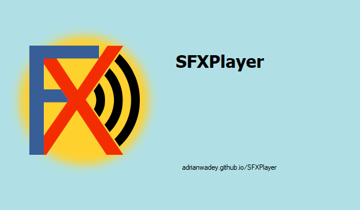
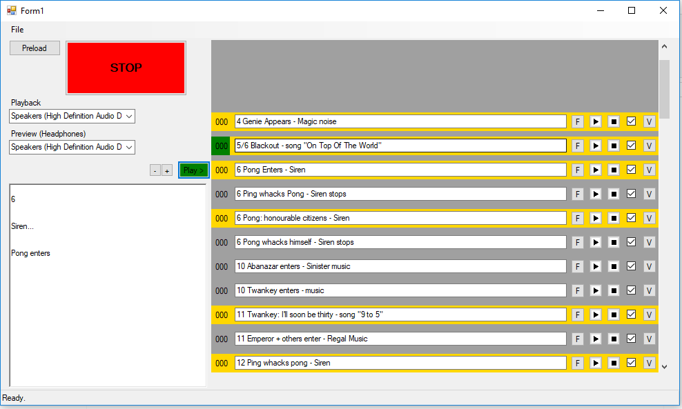
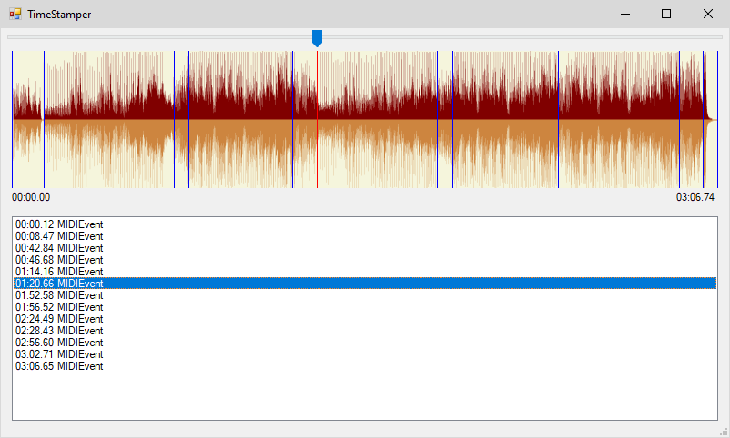

# SFXPlayer
## Windows Sound Effects Launcher ##

Sound Effects Player for theatrical use.




by Adrian Wadey

Latest release 2.0.0.5



Includes MIDI output to trigger lighting changes during music playback or Pyros during spells or - use your imagination.



### Build from source

If building from source you will need the NAudio nugget (among others)

```
project -> Manage Nugets -> restore from online sources
```

## Instructions for use

*    Click + to add a cue
*    Click the File button and choose the sound file. Click again to remove the file
*    Click the text box on the cue and change the text as needed
*    Click the stopwatch button to edit MIDI trigger points
*    F5 to Play, F4 or Esc to stop all
*    Multiple simultaneous sounds
*    There are two additional large text boxes top/bottom left that only shows for the 
previous cue (the one playing) and the selected cue
*    Check the Stop All check box on the right if you want this cue to stop all others
*    Check the Stop All check box without adding a sound to add a "Stop" cue
*    Each cue also has individual play/stop buttons
*    Right click on a cue to play it through headphones (assumes you have a separate USB 
audio device for the main output)
*    Drag audio files onto the cue list to insert new cues
*    Drag a single audio file onto a cue to replace the current audio file
*    Drag cues around to reorder them
*    Export Show will create a zip file with all the audio and the sfx file
*    Import Show will decompress a ZIP file and load the sfx file


## To do:

~~Icons for pause, file/loaded file, volume.~~

The drawing of the progress bar behind the PlayStrip causes the PlayStrip to flicker.

The TableLayoutPanel when the application resizes smaller doesn't resize the Panel leaving an extra scroll region at the bottom.

The TableLayoutPanel, especially dragging the scroll-bar doesn't support scrolling in whole units so it easy to end up with the PlayStrip nonaligned with the Play button.
I had to catch the mousewheel and trigger a timer, 
allow the system to scroll the panel and then in the timer event reset the scroll to whole control 
units. Would like a better way to do this.

~~Should pre-loading be automatic and if so how many files should it pre-load and when should the pre-load trigger?~~ Pre-loading is automatic
