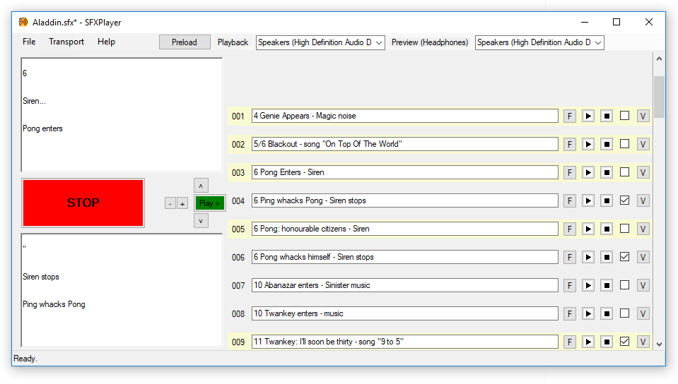

# SFXPlayer
## Windows Sound Effects Launcher ##

by Adrian Wadey

Sound Effects Player for theatrical use.

*    Click + to add a cue
*    Click the "F" File button and choose the sound file. Click "F" again to remove the file
*    Click the text box on the cue and change the text as needed
*    F5 to Play, F4 to stop all
*    Multiple simultaneous sounds
*    There is an
additional large text box bottom left but that only shows for the currently 
selected cue
*    Check the Stop All check box on the right if you want this cue to stop all others
*    Check the Stop All check box without adding a sound to add a "Stop" cue
*    Each cue also has individual play/stop buttons
*    Export Show will create a zip file with all the sounds and the sfx file
*    Import Show will decompress a ZIP file and load the sfx file

## To do:

Audio preview isn't supported yet. Should be fairly easy - just play through the alternate device.

Program/sfx file Icon

File button Icon(s?) - probably folder/wav/mp3...

Volume Icon

Improve the cue selection. At the moment you have to scroll up and down using the scroll bar far right.

Scrolling in whole control units is not easy. I had to catch the mousewheel and trigger a timer, 
allow the system to scroll the panel and then in the timer reset the scroll to whole control units. Would 
like a better way to do this.

